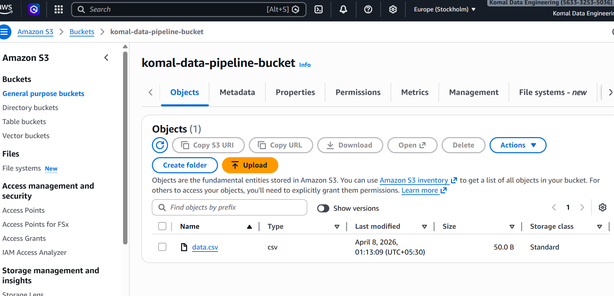
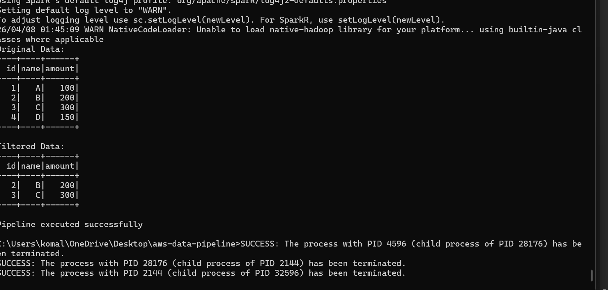
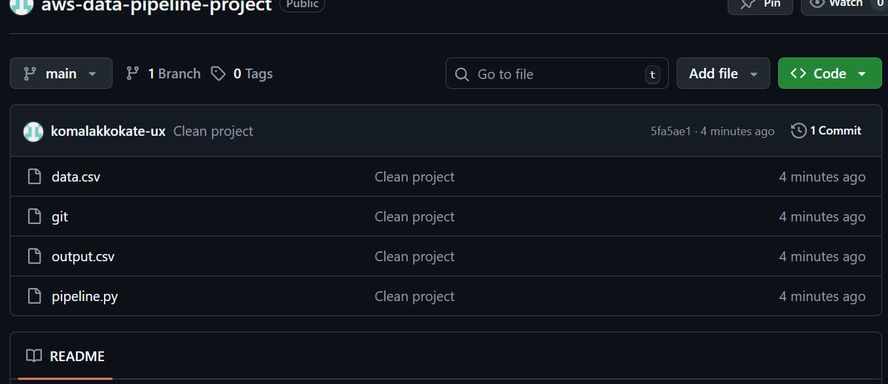

# AWS Data Pipeline Project 

##  Overview

This project demonstrates a simple data pipeline using PySpark and AWS S3.

* Read CSV data from S3
* Process data using PySpark
* Save output locally

---

##  Tech Stack

* Python
* PySpark
* AWS S3
* Git & GitHub

---

##  Project Structure

```
aws-data-pipeline/
│── pipeline.py
│── data.csv
│── output.csv
│── screenshots/
│── README.md
```

---

##  How to Run

1. Install dependencies

```
pip install pyspark pandas
```

2. Run the pipeline

```
python pipeline.py
```

---

##  Screenshots

### 🔹 S3 Bucket



### 🔹 Output File



### 🔹 Code Execution



---

##  Security Note

AWS credentials are NOT hardcoded. Secure methods should be used like environment variables or IAM roles.

---

## 🙋 Author

Komal Kokate

This project is for learning purposes only. Unauthorized commercial use is not allowed.
